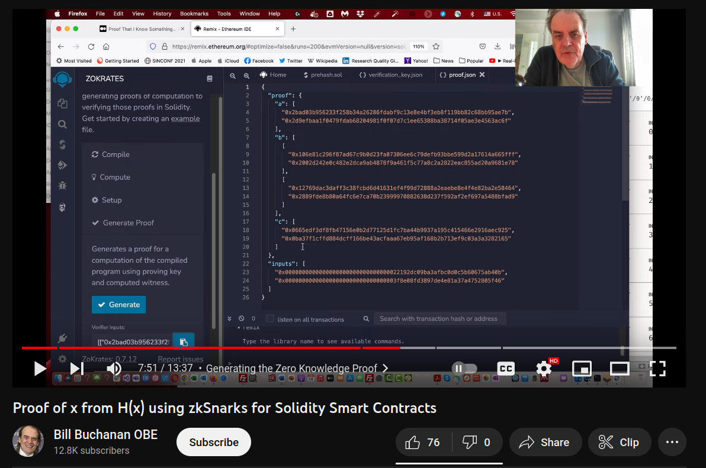

Live demo: https://weathered-cell-1216.on.fleek.co/
video: https://youtu.be/3U2RsQvmx0E
## Mission 19: Zero Knowledge Proof ZoKrates



Image credit: https://www.youtube.com/watch?v=NMa479P8r0Y

## Overview

Create a zero knowledge proof contract with ZoKrates with Shardeum.

## Requirements

Create a smart contract called: ```ZeroKnowledgeProofZoKrates``` which:

    -is deployed to Sphinx 1.1
    -is generated from a ZoKrates circuit
    -ZoKrates circuit logic should have:
        -public 
            -input(s)
            -output(s)
        -private 
            -inputs(s)

Create a basic frontend for ```ZeroKnowledgeProofZoKrates``` which:

    -is hosted on IPFS/Filecoin using Fleek for easy access
    -allows user to connect Metamask wallet with a button
    -has a simple interface for:
        -inputs 
        -proof verification

## Resources

Computing a Hash using ZoKrates

https://zokrates.github.io/examples/sha256example.html#computing-a-hash-using-zokrates

Proof of x from H(x) using zkSnarks for Solidity Smart Contracts 

https://www.youtube.com/watch?v=NMa479P8r0Y

Example ZoKrates Verifier contract deployed to Sepolia testnet:

ZoKrates circuit:

```solidity
import "hashes/sha256/512bitPacked" as sha256packed;

def main(private field a, private field b, private field c, private field d,field h0, field h1) {
  field[2] h = sha256packed([a, b, c, d]);
  assert(h[0] == h0);
  assert(h[1] == h1);
  return;
  // Input: 'a' -> 0,0,0,97
  // assert(h[0] == 45324487246557938747332883189457400843)
  // assert(h[1] == 84478852209878349000735790184433475398)
}
```

Verifier.sol on Sepolia :

https://sepolia.etherscan.io/address/0xbe7d33cee356236fc02f09f7ffbb0ab90af237a6#code

calldata for test (proof and input data copied from ZoKrates)
:warning: removed quotes from the input values to avoid Etherscan BigNumber error :warning:
```solidity
[["0x2bb0b66df8e2f7a17f8b38516d5f834404077f5c81abb485e7ccf98d2fb44bb4","0x1a7480811eea3b13dfe57a8760ce8a2560ad3e7e07754572eec9a9420f338d59"],[["0x1c273b90d0fbb8cb1c84a12ef71edb960a6b2825b7f8317e149c23a52ac10813","0x2822f95ca4abb1b86dc009432b7302e4e873bafa1698e963c5f783767019bd95"],["0x021b55da9717e0dd50c1d4b5c80eda926f8ff6f6cdf8fc0493e3b4bc7886d2db","0x21e02130eba51672a5b374df9bc6af5f1117dac631523a77dc9c6dceba17a1a3"]],["0x0a59fa02e772c30585c0cd31c527badea18fb62a39f441e8ee7858b053c6ee8e","0x13025f0f572a08198f27ef168313d5516c8c041efea6ba9fcfb609d8a41a6208"]],[0x0000000000000000000000000000000022192dc09ba3afbc0d0c5b60675ab40b,0x000000000000000000000000000000003f8e08fd3897de4e81a37a4752805f46]
```8ac91b0ff52c3c2421267ee6da7da","0x000000000000000000000000000000006df16755c25f7be7dd284bf4ea2ecf84"]
```

