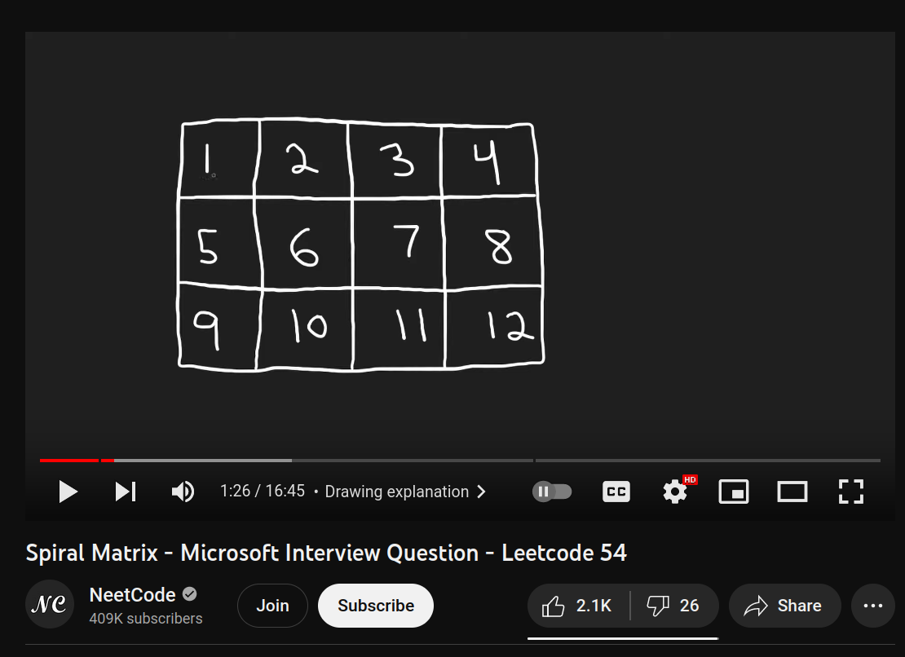

## Mission 24: Spiral Matrix

Image credit: https://www.youtube.com/watch?v=BJnMZNwUk1M

## Overview

Create spiral image changes with a Solidity smart contract.

## Requirements

You are given a grid called Water which looks like:

Create a smart contract called: `SpiralMatrix` which:
        
    -is deployed to Betanet 1.X
    -has the Water grid defined as a 4x3 array with the shown starting values 
    -spiralClockwise
        -rotates the Water values clockwise in a spiral matter
    -spiralCounterClockwise
        -rotates the Water values counterclockwise in a spiral matter

Create a basic frontend which:

    -is hosted on IPFS/Filecoin using Fleek for easy access
    -allows user to connect Metamask wallet with a button
    -allows user to interact with all features mentioned above

## Resources

Spiral Matrix - Microsoft Interview Question - Leetcode 54 
 
https://www.youtube.com/watch?v=BJnMZNwUk1M