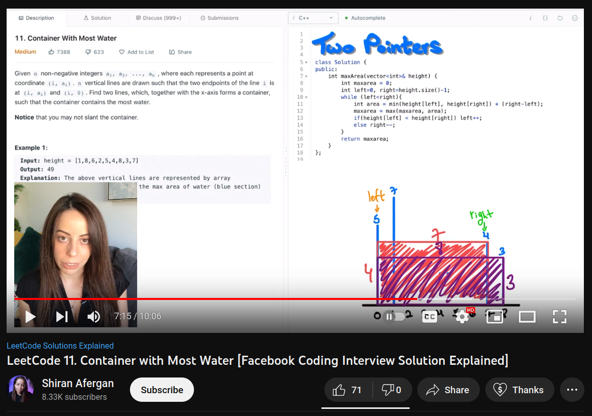

## Mission 9: Water Tank Volume

<a href="https://quiet-resonance-5569.on.fleek.co">Website Link(quiet-resonance-5569.on.fleek.co)</a>

<a href="https://youtube.com/shorts/Dm0izSM_RZ4"> Video (youtube.com/shorts/Dm0izSM_RZ4)</a>



Image credit: https://www.youtube.com/watch?v=5HU0iQ1wlMo

## Overview

Solidity programming challenge for
creating random wall heights that hold water based on time, then computing the max water volume held by the random walls.

## Requirements

Create a smart contract called: ```WaterTankVolume```, which:

    -is deployed to Shardeum Liberty 2.1
    -there is a mapping with a struct: address => userWaterTankData
    -struct userWaterTankData includes:
        -currentBlockTime
        -currentTankWalls
        -totalTanks
        -currentWaterVolume
        -maxWallPair
        -totalWaterVolume
    -currentTankWalls:
        -the tank has the following dimensions:
            -length: 9 (x-axis)
            -width:  1 (z-axis)
            -height: 8 (y-axis)
        -to keep things simple, assume we have an 8x9 grid
        -array for each wall height:
            -x = 0 has no wall 
            -currentTankWalls[0] represents x = 1 
            -currentTankWalls[8] represents x = 9
    -function createNewMap:
        -updates currentTankWalls from block.timestamp (uint) that is saved into currentBlockTime with logic:
            -decimal places represent wall height:
            -time to wall array logic step by step:
                -decimal value for unix time example: 1673409443
                -ignore the first decimal place: 673409443
                -convert each decimal place to wall height array from left to right: [6,7,3,4,0,9,4,4,3]
                -convert all 0 values to 1 and all 9 values to 8: [6,7,3,4,1,8,4,4,3]
        -increase totalTanks by 1
    -function currentTankMaxWaterVolume:
        -compute the maximum current volume with two pointers in maxWallPair
        -save the wall pair index values
            -Note: there might be multiple possible max volume pairs, just select one that is simple to compute
        -increase the totalWaterVolume by currentWaterVolume

Create a basic frontend for ```WaterTankVolume``` which:

    -is hosted on IPFS/Filecoin using Fleek for easy access
    -allows user to connect Metamask wallet with a button
    -shows the values for the connected wallet: 
        -currentBlockTime
        -totalTanks
        -currentWaterVolume
        -maxWallPair
        -totalWaterVolume
    -shows currentTankWalls as a 2D grid (length and height shown, width comes in and out of the page) with:
        -the walls with no water when new tank walls created
        -water filled between walls with the maximum value using maxWallPair values
    -has buttons for:
        -for creating new tank walls based on time
        -for calculating the maximum volume possible with the current walls

## Resources

LeetCode 11. Container with Most Water [Facebook Coding Interview Solution Explained] 

https://www.youtube.com/watch?v=5HU0iQ1wlMo
