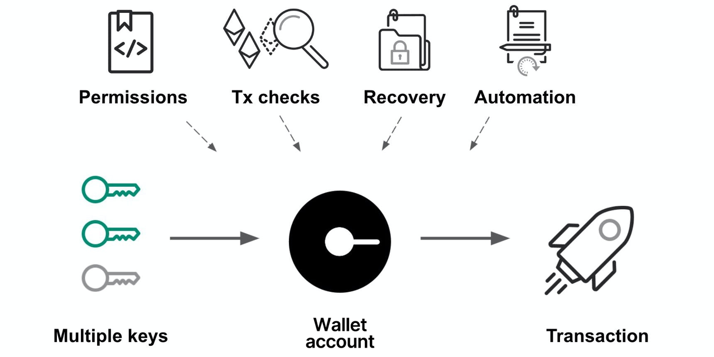
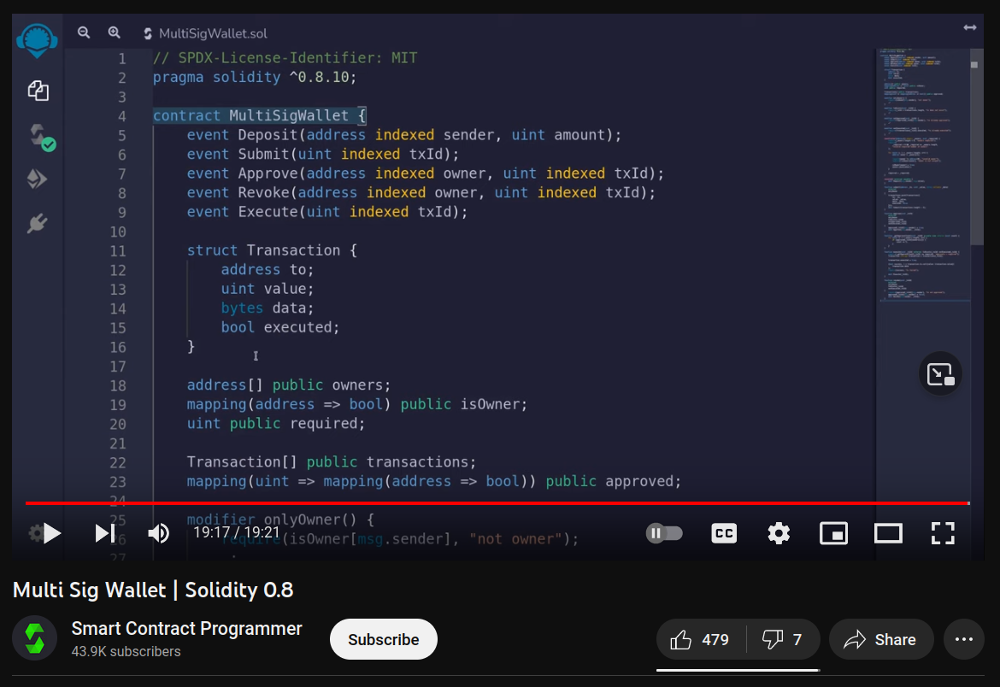

## Mission 16: Multisignature Wallet Factory



Image credit: https://study.bitkeep.com/en/?ht_kb=beware-of-multisig-wallet-fraud

## Overview

Solidity programming challenge for creating and maintaining Multisignature Wallets. 

## Requirements

Create a smart contract called: ```MultiSigWallet``` which:

    -is deployed to Sphinx 1.1
    -is the contract mentioned below in the resources section

Create a smart contract called: ```MultiSigWalletFactory``` which:

    -is deployed to Sphinx 1.1
    -has mappings:
        -multiSigWalletsCreatedTotal: uint256 => multisigDeployedAddress
        -multiSigWalletsCreatedByUser: userAddress => (uint256 => multisigDeployedAddress)
    -deployMultiSigWithCreate:
        -deploys a new MultiSigWallet.sol contract with create
        -increments multiSigWalletsCreatedTotal with the new MultiSigWallet contract address
        -increments multiSigWalletsCreatedByUser for msg.sender
    -deployMultiSigWithCreate2:
        -takes user input salt and shows the simulated address for MultiSigWallet.sol on the frontend
        -deploys a new MultiSigWallet.sol contract with create2 with the user input salt
        -increments multiSigWalletsCreatedTotal with the new MultiSigWallet contract address
        -increments multiSigWalletsCreatedByUser for msg.sender

Create a basic frontend for ```MultiSigWallet``` and ```MultiSigWalletFactory``` which:

    -is hosted on IPFS/Filecoin using Fleek for easy access
    -allows user to connect Metamask wallet with a button
    -shows: 
        -multiSigWalletsCreatedTotal and multiSigWalletsCreatedByUser for MultiSigWalletFactory
        -all of the read data used from MultiSigWallet to emulate Remix IDE when a MultiSigWallet address is selected
    -has button for functions:
        -deployMultiSigWithCreate and deployMultiSigWithCreate2 for MultiSigWalletFactory, 
        which should hide the salt input text box when default option deployMultiSigWithCreate is selected
        -all of the buttons used from MultiSigWallet to emulate Remix IDE when a MultiSigWallet address is selected

## Resources

Multi Sig Wallet | Solidity 0.8 



https://www.youtube.com/watch?v=8ja72g_Dac4

Solidity By Example MultiSigWallet

https://solidity-by-example.org/app/multi-sig-wallet/

Solidity 2D Mapping

https://ethereum.stackexchange.com/questions/93212/solidity-how-to-do-2d-mapping-syntax-error
