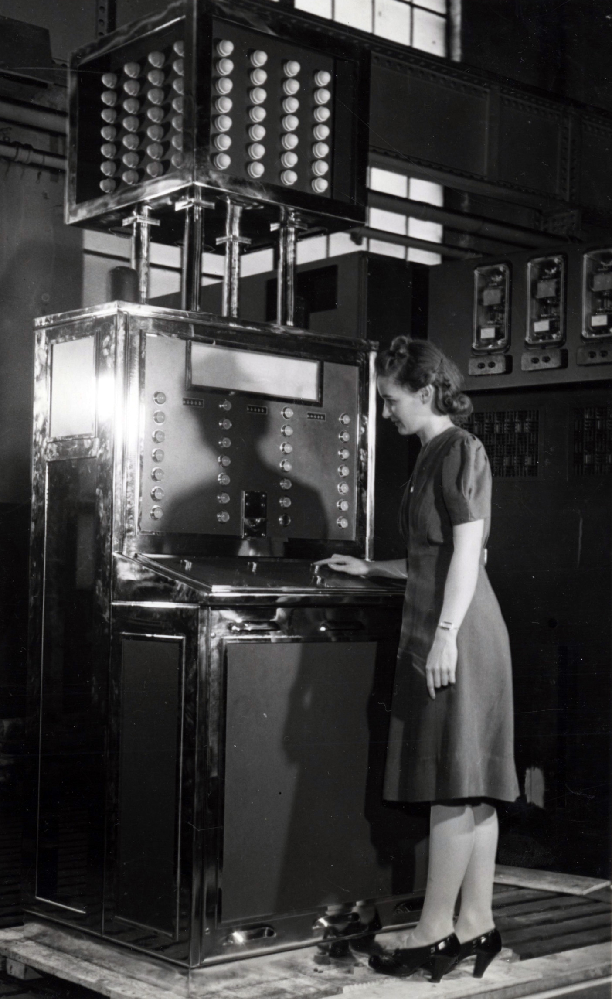
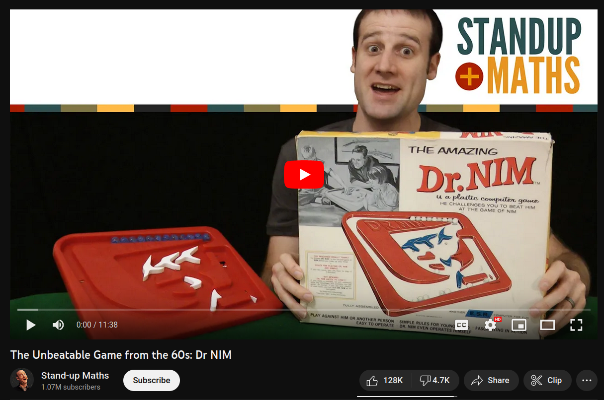
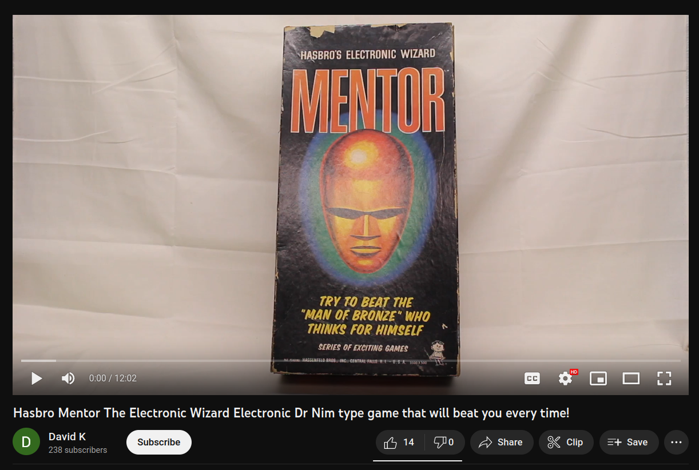

# Mission 2: Nim

## Demo and frontend 

Frontend : https://super-cake-3763.on.fleek.co/missions/new/2/
Demo : https://youtu.be/KEs1URU-nFA



Image Credit: https://bojoga.com.br/artigos/retroplay/jogos-eletromecanicos/nimatron/

Fun fact: Nim is one of the earliest computer games ever made.
The Nimatron (1939) is a relay based computer version for Nim,
and was created before transistors were discovered (1947)  https://en.wikipedia.org/wiki/Nimatron

## Overview

There are 12 marbles on a board.
Take the last marble to win the game.

## Requirements

Create a smart contract called ```Nim``` which plays Nim against a player where:

     -there is a mapping with a struct: address => playerStates
     -struct playerStates includes:
          -marblesOnTable
          -playerWins
          -computerWins
     -function newGame sets marblesOnTable = 12 if marblesOnTable == 0
     -the player can take 0 to 3 marbles if on the first turn marblesOnTable == 12
     -the player can take 1 to 3 marbles if after the first turn marblesOnTable < 12
     -function turn removes the marbles from the board for the player, then the computer will:
          -take 1 marble if marblesOnTable == 4 or marblesOnTable == 8 or marblesOnTable == 12
          -take marblesOnTable%4 marbles (player with turn starting on 4 or 8 will likely lose)
          -take marblesOnTable marbles if marblesOnTable < 4
     -if the player wins, the playerWins value increases by 1
     -if the computer wins, the computerWins value increases by 1

Create a basic frontend for playing ```Nim``` which:

    -is hosted on IPFS/Filecoin using Fleek for easy access
    -allows user to connect Metamask wallet with a button
    -shows all data from connected wallet from playerStates struct
    -shows the marbles on the board based on marblesOnTable for connected user
    -has a newGame button to start a new game
    -has a turn button with an input box for the user marbles to take for that turn

## Resources

The Unbeatable Game from the 60s: Dr NIM

https://www.youtube.com/watch?v=9KABcmczPdg

[](https://www.youtube.com/watch?v=9KABcmczPdg)

Hasbro Mentor The Electronic Wizard Electronic Dr Nim type game that will beat you every time!

https://www.youtube.com/watch?v=5N0yhBnL0SQ

[](https://www.youtube.com/watch?v=5N0yhBnL0SQ)

Single Pile Nim

https://www.jamieyorkpress.com/wp-content/uploads/2020/10/NIM-Game-all-four-versions.pdf
