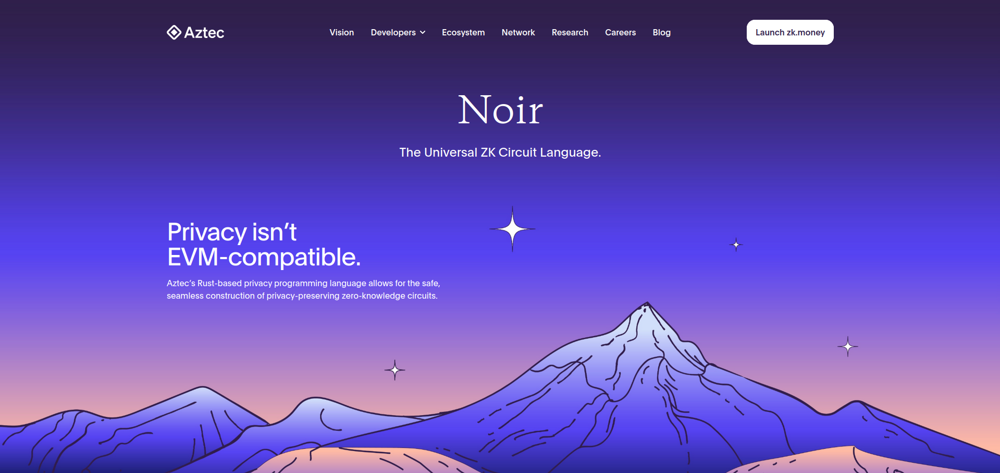

## Mission 20: Zero Knowledge Proof Noir



Image credit: https://aztec.network/noir/

## Overview

Create a zero knowledge proof contract with Noir with Shardeum.

## Requirements

Create a smart contract called: ```ZeroKnowledgeProofNoir``` which:

    -is deployed to Sphinx 1.1
    -is generated from a Noir circuit
    -Noir circuit logic should have:
        -public 
            -input(s)
            -output(s)
        -private 
            -inputs(s)

Create a basic frontend for ```ZeroKnowledgeProofNoir``` which:

    -is hosted on IPFS/Filecoin using Fleek for easy access
    -allows user to connect Metamask wallet with a button
    -has a simple interface for:
        -inputs 
        -proof verification

## Resources

Setup Noir By Installing Nargo

https://noir-lang.org/getting_started/nargo/nargo_installation 

Simple Noir circuit example in Rust 

https://noir-lang.org/getting_started/hello_world/hello_world#intro-to-noir-syntax 

Generate verifier contract from Noir circuit

https://noir-lang.org/getting_started/solidity_verifier 

Example Noir Verifier contract deployed to Sepolia testnet

https://sepolia.etherscan.io/address/0xa66cc96316a4df10b96dc3e62dae184d04e93ad9#code