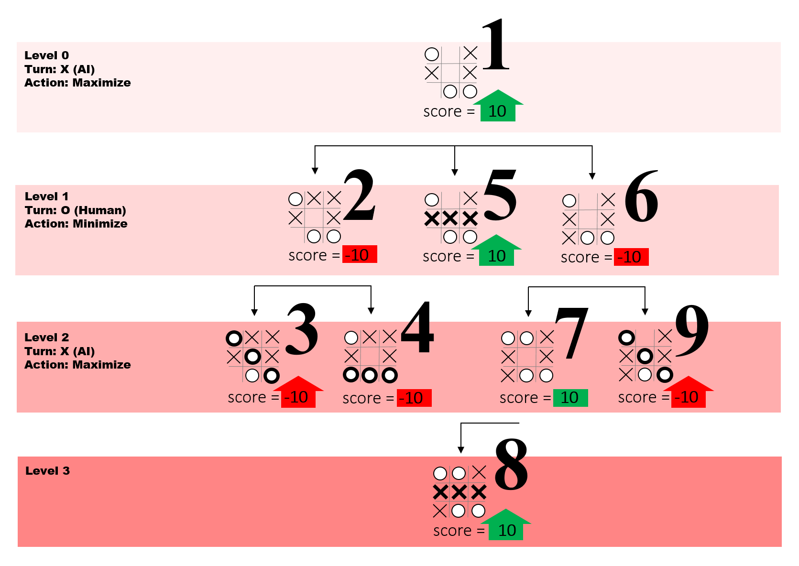

# Mission 3: Minimax Tic Tac Toe

Image Credit: https://www.freecodecamp.org/news/how-to-make-your-tic-tac-toe-game-unbeatable-by-using-the-minimax-algorithm-9d690bad4b37/

## Overview

Solidity programming challenge for creating Tic Tac Toe with a computer which plays using the minimax algorithm.

## Requirements

Create a smart contract called `TicTacToe` which plays Tic Tac Toe against a player where:

     -there is a mapping with a struct: address => playerStates
     -struct playerStates includes:
          -boardState
          -playerWins
          -computerWins
          -tiedGames
     -function newGame sets boardState back to being empty if the game is a tie
     -player can be:
          -X (goes first)
          -O (goes second)
     -a valid turn has:
          -the player place a piece on the board that is not already taken from boardState,
          -after the player places a piece, the computer will use the minimax algorithm to determine where to place its piece
     -if no one wins and no valid moves are left, tiedGames increases by 1
     -if the player wins, the playerWins value increases by 1
     -if the computer wins, the computerWins value increases by 1

Create a basic frontend for playing `TicTacToe` which:

    -is hosted on IPFS/Filecoin using Fleek for easy access
    -allows user to connect Metamask wallet with a button
    -shows the 3 x 3 Tic Tac Toe board based on boardState
    -shows playerWins, computerWins and tiedGames
    -player clicks an open square to take a turn

## Resources

How to make your Tic Tac Toe game unbeatable by using the minimax algorithm

https://www.freecodecamp.org/news/how-to-make-your-tic-tac-toe-game-unbeatable-by-using-the-minimax-algorithm-9d690bad4b37/

[Website link](https://mute-shape-4306.on.fleek.co/)
[Demo link](https://youtu.be/OSZTqNYPxfI)
