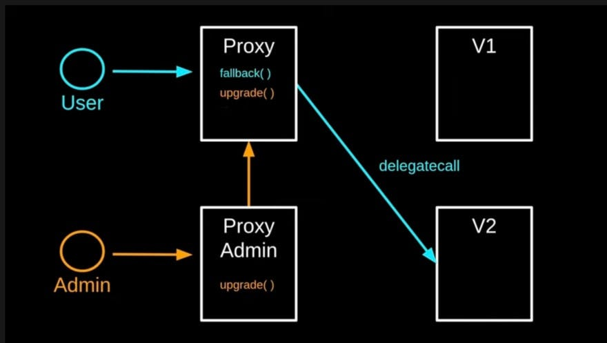

# Mission 31: Upgradable smart contract

## Overview

Build an upgradeable smart contract application on Shardeum whcih lets the deployer change a variable in the contract with a proxy.

## Requirements

Create a smart contract called: `UpgradableContract` which:
        
- is deployed to [Sphinx Dapp 1.X](https://docs.shardeum.org/network/endpoints#shardeum-sphinx-dapp-1x) network.

- has a contract `UpgradableContract`
     - which contains the variable that can be modified (Example: uint256 public importantVariable;)

    - this contract also contains a function to modify `importantVariable` (Example: function changeImportantVariable(uint256 newValue))

    - this contract must include an upgrade function that allows the contract deployer to change the logic within the contract (Example: function upgradeContract(address newImplementation))
    - ensure that only the original deployer can change the implementation to prevent malicious upgrades
- has a proxy contract `ProxyContract`
    - this contract is the one users interact with and forwards calls to `UpgradableContract`
    - this contract must be able to change the reference to `UpgradableContract` to allow upgrades
    - make sure only the original deployer can change the reference to `UpgradableContract` to prevent malicious upgrades

           
Create a basic frontend which:

    - is hosted on IPFS/Filecoin using Fleek/Spheron for easy access
    - allows user to connect Metamask wallet with a button
    - allows the user to read the inital(before upgrade) and final(after upgrade) value
    - allows the user to change the value/update

## Submission
- Only submission through the official [Submission form](https://forms.gle/mXN3a3EQHz52ShWS8) will be accepted.
- Live application link must also be shared in the [missions-discussion](https://discord.com/channels/933959587462254612/1039929816843038750) channel in Shardeum discord. 

## Resources

Understanding Upgradeable Smart Contracts

https://docs.openzeppelin.com/learn/upgrading-smart-contracts

Shardeum Documentation

https://shardeum.com/docs/

OpenZeppelin Contracts: Upgradeable Smart Contract Framework

https://github.com/OpenZeppelin/openzeppelin-contracts

Upgradable Smart Contracts Article

https://blog.openzeppelin.com/the-state-of-smart-contract-upgrades/

IPFS/Filecoin Hosting on Fleek

https://docs.fleek.co/

If you have any queries, reach out to :  Sandipan(.sandipan) on discord.