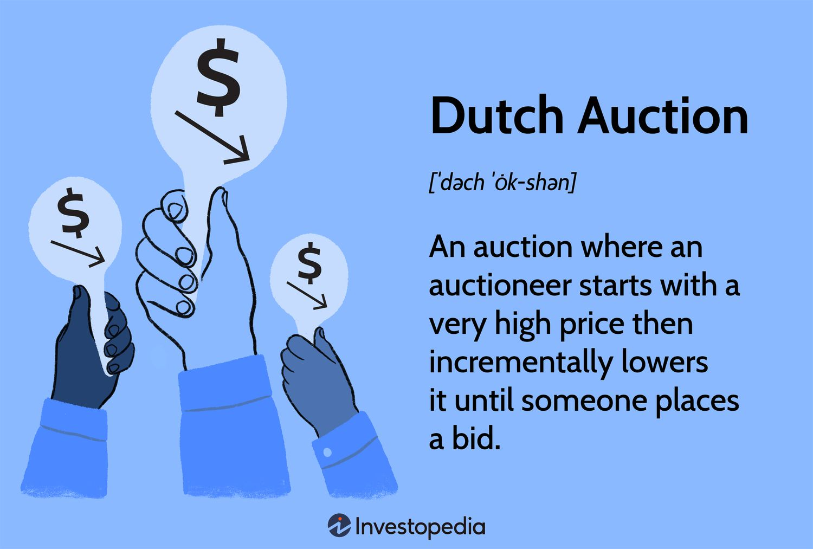

# Mission 32: NFT Dutch Auction application

## Overview

Build a web3 dapp on Shardeum that implements a Dutch auction style for Non-Fungible Tokens (NFTs).

## Requirements

Create an NFT Dutch Auction system named `NFTDutchAuction`, which:

- is deployed to [Sphinx Dapp 1.X](https://docs.shardeum.org/network/endpoints#shardeum-sphinx-dapp-1x) network.
- follows the ERC721 standard for NFTs
- includes a contract `NFTAuctionContract`
    - this contract contains the auction details like start price, end price, start time, and duration
    - this contract must have a function to start a Dutch auction (Example: function startAuction(uint256 _tokenId, uint256 _startPrice, uint256 _endPrice, uint256 _duration))
    - this contract must have a function to bid on the auction (Example: function bidOnAuction(uint256 _tokenId))
    - auction prices must decrease linearly from the start price to the end price over the duration
    - ensure that only the owner of the NFT can start the auction and only other addresses can bid
    - duration for auction is 5 days

           
Create a basic frontend which:

- is hosted on IPFS/Filecoin using Fleek for easy access
- allows the user to connect their Metamask wallet with a button
- allows the user to interact with all features mentioned above
- has a visible display for all ongoing auctions and their current prices
- allows users to start an auction for their NFT and bid on ongoing auctions

## Submission
- Only submission through the official [Submission form](https://forms.gle/mXN3a3EQHz52ShWS8) will be accepted.
- Live application link must also be shared in the [missions-discussion](https://discord.com/channels/933959587462254612/1039929816843038750) channel in Shardeum discord. 

## Resources

Shardeum Documentation

https://shardeum.com/docs/

OpenZeppelin Contracts: Upgradeable Smart Contract Framework

https://github.com/OpenZeppelin/openzeppelin-contracts

IPFS/Filecoin Hosting on Fleek

https://docs.fleek.co/