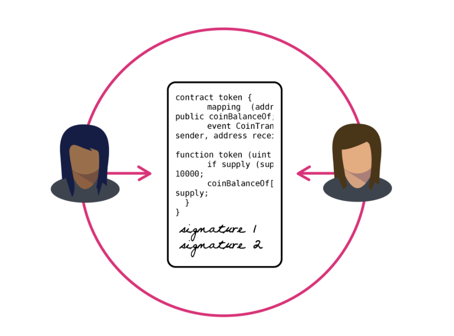

# Mission 36: Smart contract Event Subscriber

## Overview

Develop an application that actively listens to and displays all the events emitted by a specific smart contract on Shardeum.

## Requirements

- Be deployed on the Sphinx Dapp 2.X network.
- The user should be able to input the smart contract address they're interested in.
- Display real-time events as they are emitted by the contract in an easy-to-read manner.
- Ensure robust error handling for scenarios where the contract address is wrong or the contract doesn't emit any events.
- Provide a user-friendly interface, potentially with filters to view specific events or data.

## Submission
- Only submission through the official [Submission form](https://forms.gle/mXN3a3EQHz52ShWS8) will be accepted.
- Live application link must also be shared in the [missions-discussion](https://discord.com/channels/933959587462254612/1039929816843038750) channel in Shardeum discord. 

## Resources

Shardeum Documentation

https://shardeum.com/docs/

IPFS/Filecoin Hosting on Fleek

https://docs.fleek.co/
