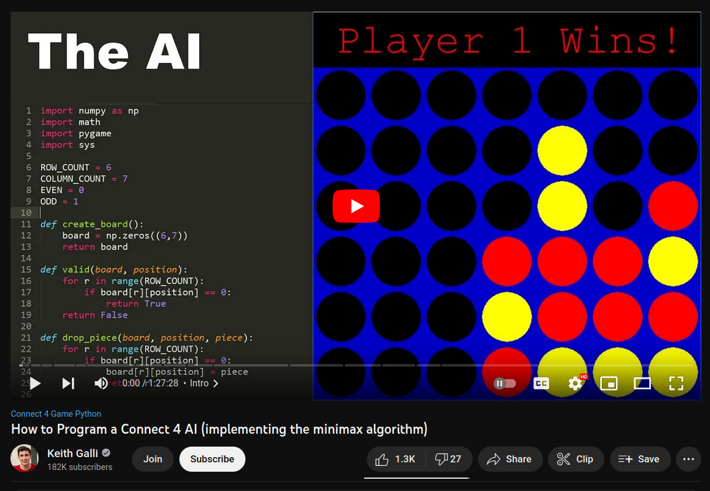

# Mission 3: Minimax Connect 4 

[Best Frontend: Website](https://quiet-bush-2358.on.fleek.co/)

[Best Frontend: Video](https://youtu.be/k_UK88111fQ)

Image Credit: https://www.youtube.com/watch?v=MMLtza3CZFM

## Overview

Solidity programming challenge for creating Connect 4 with a computer which plays using the minimax algorithm.

## Requirements

Create a smart contract called `Connect4` which plays Connect 4 against a player where:

     -there is a mapping with a struct: address => playerStates
     -struct playerStates includes:
          -boardState
          -playerWins
          -computerWins
          -tiedGames
     -function newGame sets boardState back to being empty if the game is a tie
     -player goes first as red
     -a valid turn has:
          -the player place a piece on the board that is not already taken from boardState,
          -after the player places a piece, the computer will use the minimax algorithm to determine where to place its piece
     -if no one wins and no valid moves are left, tiedGames increases by 1
     -if the player wins, the playerWins value increases by 1
     -if the computer wins, the computerWins value increases by 1

Create a basic frontend for playing `Connect4` which:

    -is hosted on IPFS/Filecoin using Fleek for easy access
    -allows user to connect Metamask wallet with a button
    -shows the 6 x 7 Connect 4 board based on boardState
    -shows playerWins, computerWins and tiedGames
    -player clicks an open circle to take a turn

## Resources

How to Program a Connect 4 AI (implementing the minimax algorithm) (credit: https://www.youtube.com/@KeithGalli):

https://www.youtube.com/watch?v=MMLtza3CZFM

Connect 4 Minimax AI version in Python from video above:

https://github.com/KeithGalli/Connect4-Python/blob/master/connect4_with_ai.py